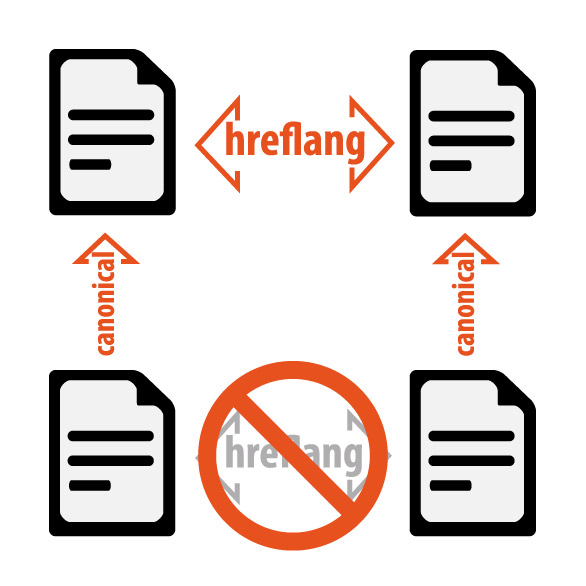

[PrestaShop "SEO ToolKit"](https://github.com/faktiva/prestashop-seo-tk)
===

___

Handles a few basic SEO related improvements such as:
* "hreflang"
* "canonical"
* "noindex"

Being reported to work on **PS >= 1.6.0.9** .. but it should work on PS 1.6.x.x too and *could work* on PS >= 1.5.0.1

For production use the **latest stable [release](https://github.com/faktiva/prestashop-seo-tk/releases/)**

For developing or Pull Request please use only the **[dev](https://github.com/faktiva/prestashop-seo-tk/tree/dev)** branch

## Canonical URLs

Insert the `<meta rel="canonical">` html tag to avoid content duplication

Query string is removed only when needed, pagination is retained and handled (an existing "prev/next" mechanism is needed, newer PS already does it)

## HrefLang

Handle multilingual sites.
Insert the `<meta rel="hreflang">` html tag, a default lang is handled too.

**hreflang meta is only added on canonical pages**, as explained in the following image and explained by [Eoghan Henn](http://www.rebelytics.com/hreflang-canonical/)

## NoIndex

Automatically assure a `<meta robots="noindex">` tag is added to every PS controller that should not been indexed by search engines.
This allows for big "robots.txt" cleanup .. and a better SEO 

The phylosophy is "Don't use robots.txt to tell robots to do not index a page, it should be used to block them .. it's different"

# License

**[PrestaShop SEO ToolKit](https://github.com/faktiva/prestashop-seo-tk)** by [Faktiva](https://github.com/faktiva) is licensed under a **Creative Commons [Attribution-NonCommercial-ShareAlike](http://creativecommons.org/licenses/by-nc-sa/4.0/) 4.0 International License**.

Permissions beyond the scope of this license may be available contacting us at info@faktiva.com.
